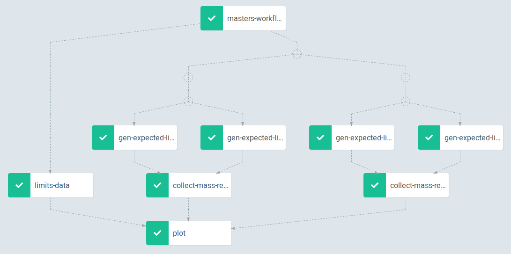

# masters2

### Argo installation

```bash
kubectl create namespace argo
kubectl apply -n argo -f https://raw.githubusercontent.com/argoproj/argo/stable/manifests/install.yaml
```

### Setup S3 storage

```bash
$ S3_HOST=$(openstack catalog show s3 -f value -c endpoints | grep public | cut -d '/' -f3)
$ ACCESS_KEY=$(openstack ec2 credentials create -f value -c access)
$ SECRET_KEY=$(openstack ec2 credentials show $ACCESS_KEY -f value -c secret)

$ kubectl create secret generic cern-s3-cred --from-literal=accessKey=$ACCESS_KEY --from-literal=secretKey=$SECRET_KEY

$ echo $S3_HOST
s3.cern.ch
```

`S3_HOST` value goes into the workflow yaml as a parameter.

### Start workflow

```bash
$ argo submit --watch masters-workflow.yaml
```



