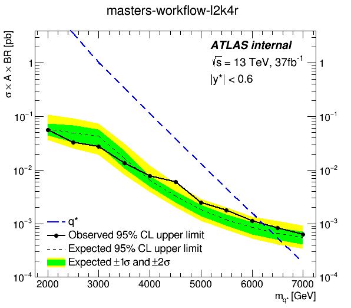

# masters2

[](https://binder.cern.ch/v2/gh/tghartland/masters2-binder/py3?urlpath=%2Flab)

### With binder

Click to launch a jupyterlab instance with the binder link above,
and follow the instructions in `README.ipynb`.

### Argo installation

```bash
$ kubectl create namespace argo
$ kubectl apply -n argo -f https://raw.githubusercontent.com/argoproj/argo/stable/manifests/install.yaml

$ kubectl apply -f workflow-rolebinding.yaml
```

The workflow rolebinding is needed by the argo sidecar container to be able to monitor the pod it is running in.

The same rolebinding will need to be created for any other namespaces that will be used for running argo workflows.

### Setup S3 storage

```bash
$ S3_HOST=$(openstack catalog show s3 -f value -c endpoints | grep public | cut -d '/' -f3)
$ ACCESS_KEY=$(openstack ec2 credentials create -f value -c access)
$ SECRET_KEY=$(openstack ec2 credentials show $ACCESS_KEY -f value -c secret)

$ kubectl create secret generic s3-cred --from-literal=accessKey=$ACCESS_KEY --from-literal=secretKey=$SECRET_KEY

$ echo $S3_HOST
s3.cern.ch
```

`S3_HOST` value goes into the workflow yaml as a parameter.

A bucket for artifact storage should be created in the S3 storage and its name
should also be given as a parameter in the workflow.

### Start workflow

```bash
$ argo submit --watch masters-workflow.yaml
```

### Workflow overview

In this example the workflow is finding expected limits at two mass points,
and running two pods in parallel at each.

```bash
$ kubectl -n argo port-forward service/argo-ui 8001:80
```


### Result

When the simulated peaks from all data points are used, and with a higher parallelism,
the final plot is produced and stored in the s3 bucket in directory `{{workflow.name}}/results`,
taking only a few minutes to complete in a large cluster.


